

   <a href="https://guan-shopping-web.web.app/" title="guan-shopping" target="_blank">
      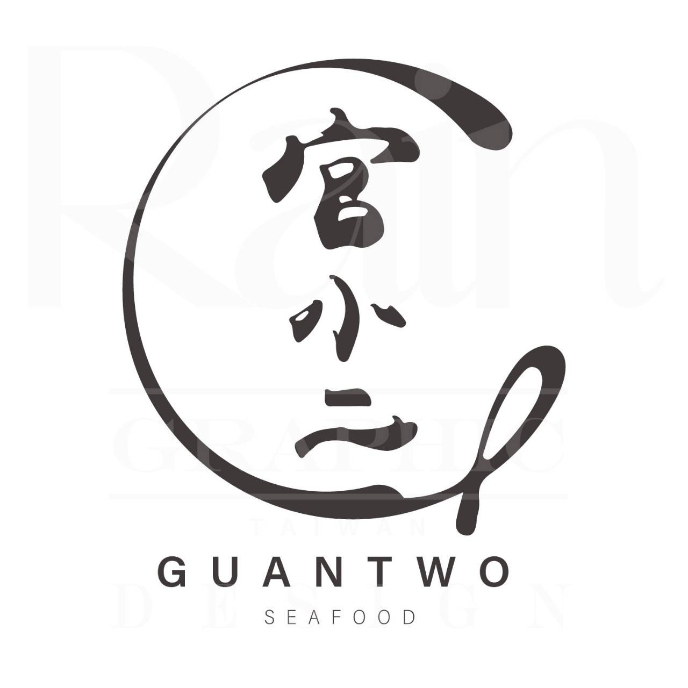
   </a>
   <h2>guan-shopping eCommerce 食品電商網站</h2>

guan-shopping eCommerce 是一個基於 React.js + Material UI + Firebase 建構而成的電子商務網站，支援 RWD，畫面以 Material UI 元件為主，樣式採用 CSS-in-JS 撰寫，平台使用者主要可分為管理員 (admin)、會員 (member) 兩種身分，管理員可自由新增、編輯、刪除商品。

## 線上演示

- Demo：https://guan-shopping-web.web.app/

## 使用技術

### 基礎應用

- HTML
- CSS
- JavaScript (ES2015)

### 前端框架、套件

- React
- React Hooks
- React Router
- Redux toolkit
- Redux Saga
- React Hook Form
- Material UI
- yup validation
- axios

### Firebase 服務

- Authentication
- Cloud Firestore
- Cloud Storage
- Cloud Function (建置中)
- Hosting

### 其他工具

- ESLint
- Prettier

### 專案功能

- 使用 Firebase Authentication 管理用戶
- 使用 Firebase Firestore 操作資料庫
- 使用 Firebase Storage 上傳圖片
- 使用 Google Cloud 儲存快取
- 使用 Redux toolkit 管理狀態
- 使用 React Hook Form 登入驗證
- 使用 yup 上架、編輯商品驗證
- 購物車 (CRUD)
- 商品管理 (CRUD)
- 骨架屏載入
- 發送密碼重製郵件
- 模擬金流結帳 (建置中)

## 網站展示

- 首頁

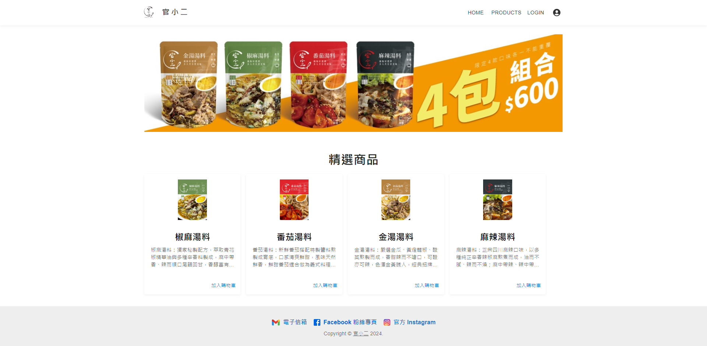

- 商品列表

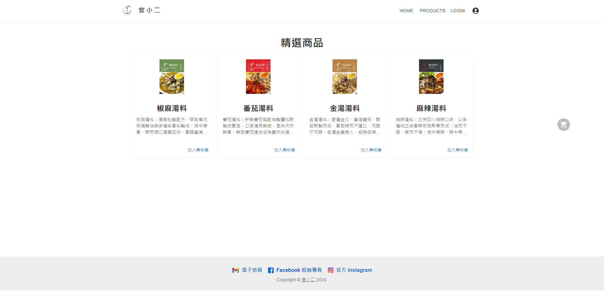

- 商品資訊

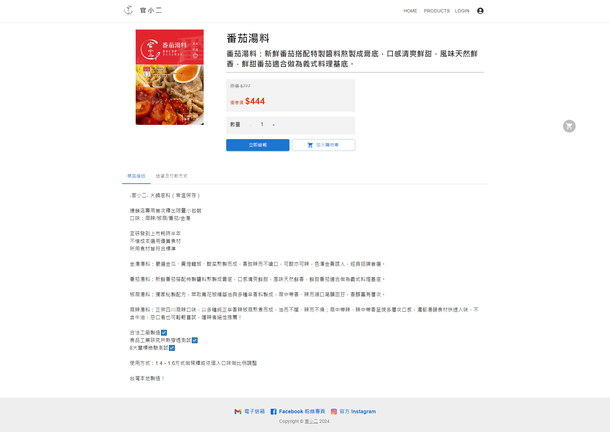

- 登入/註冊會員

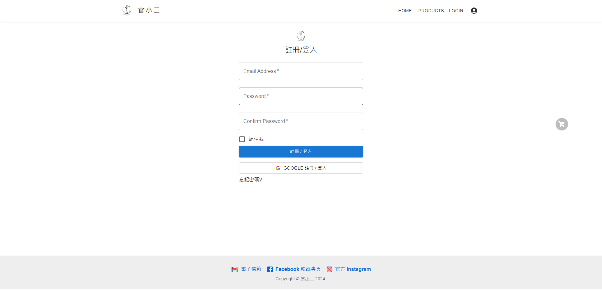

- 購物車

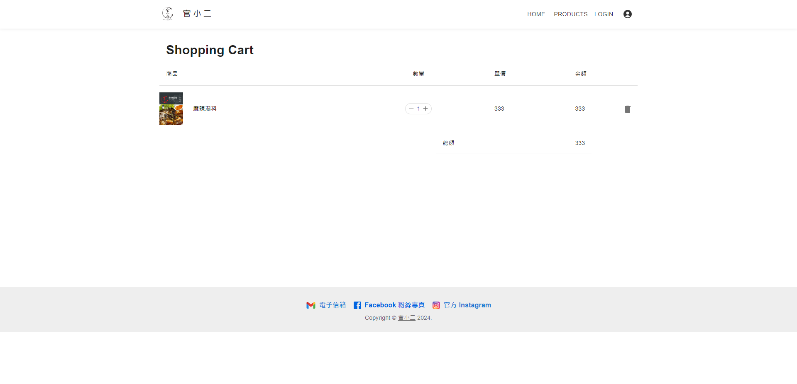

- 後台 - 新增商品

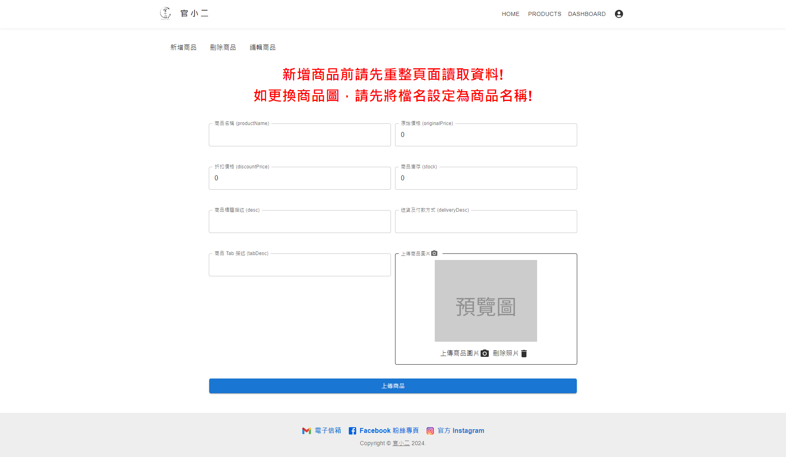

- 後台 - 編輯商品

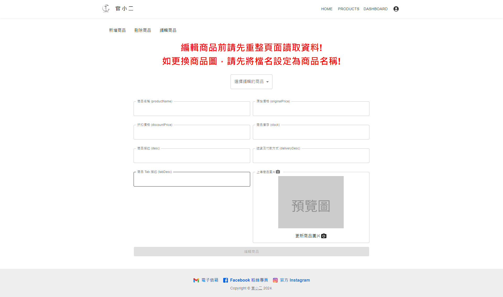

- 後台 - 刪除商品

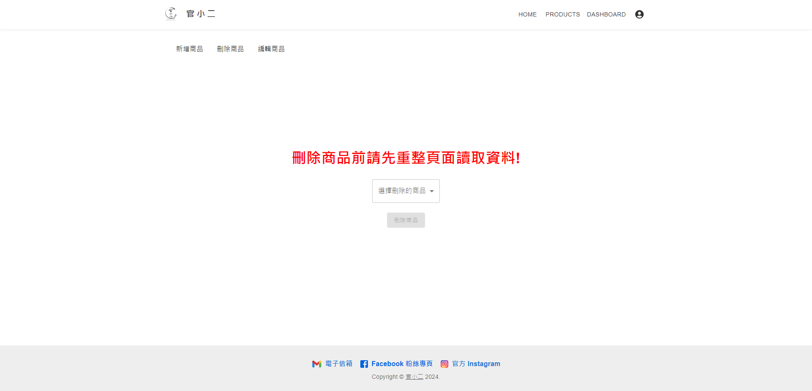

- 骨架屏 - 商品列表

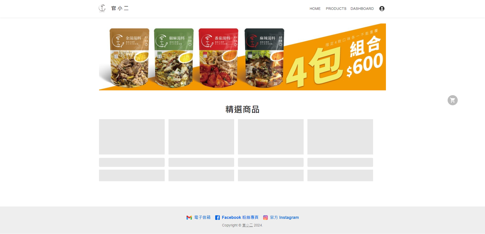

- 骨架屏 - 商品資訊

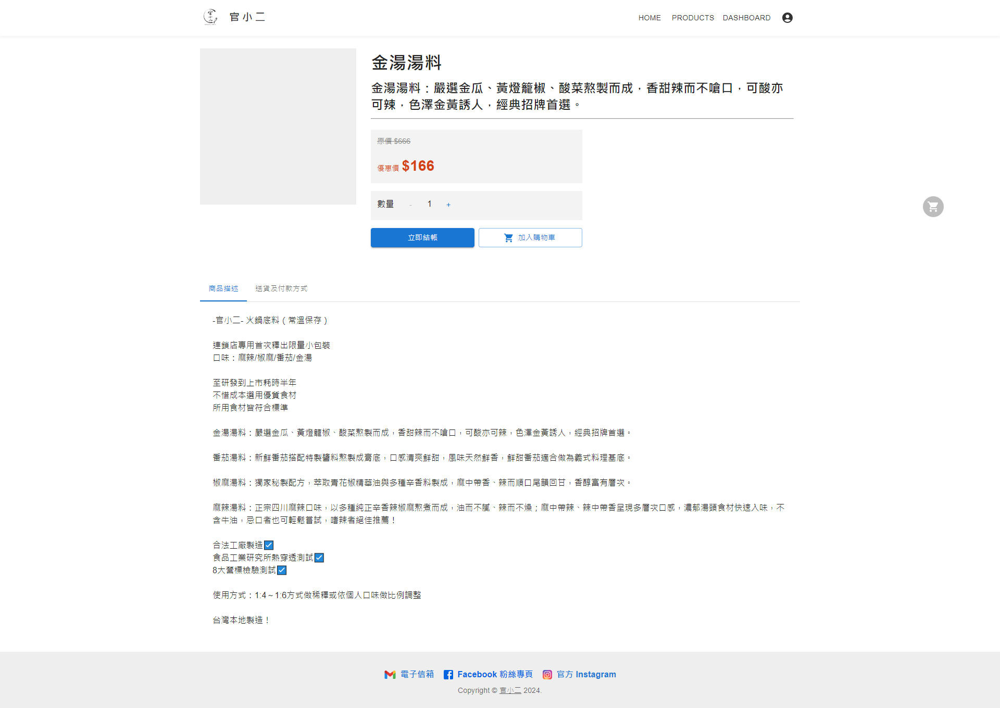