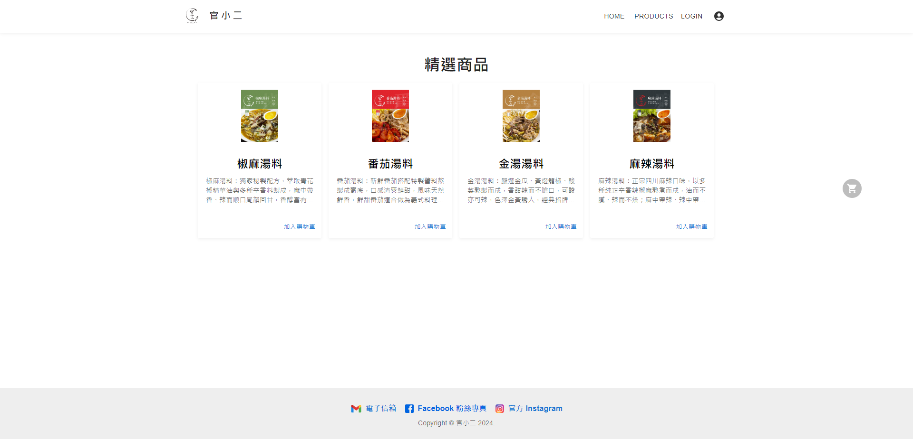
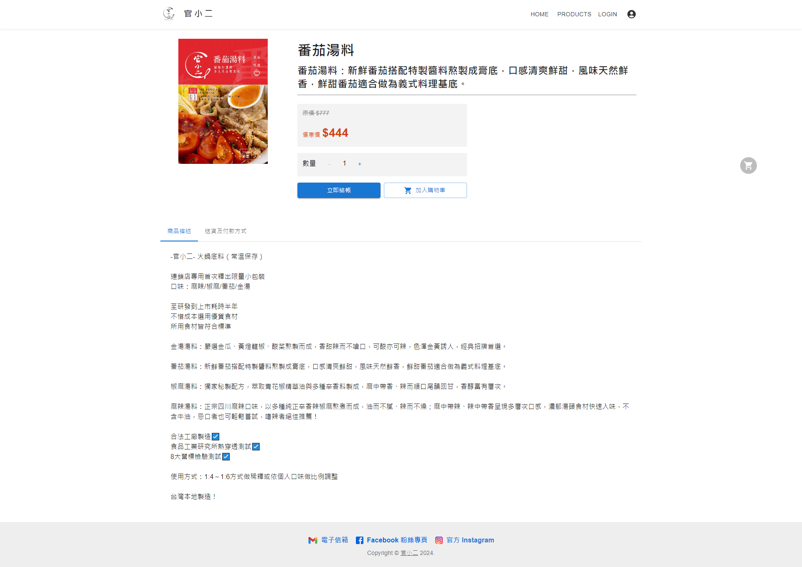
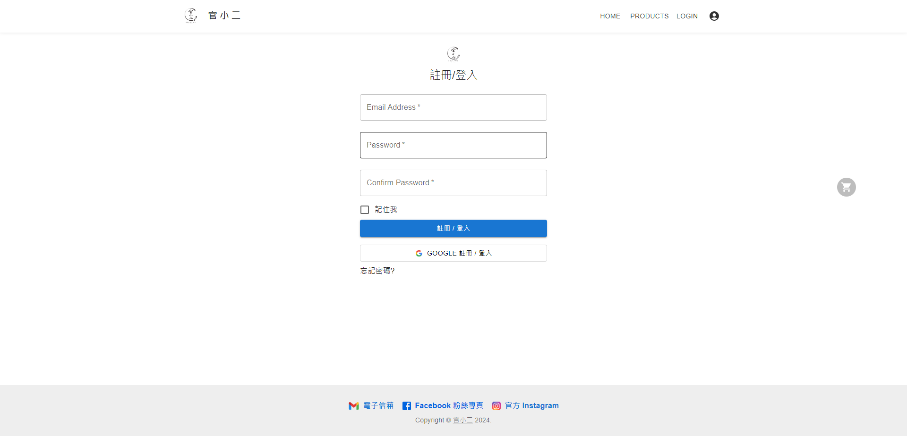
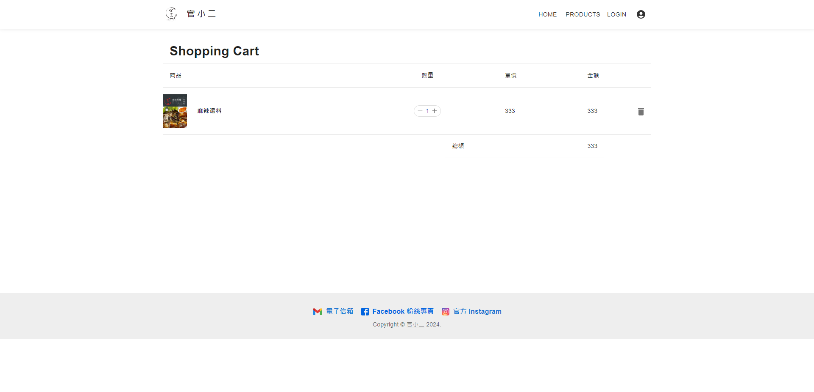
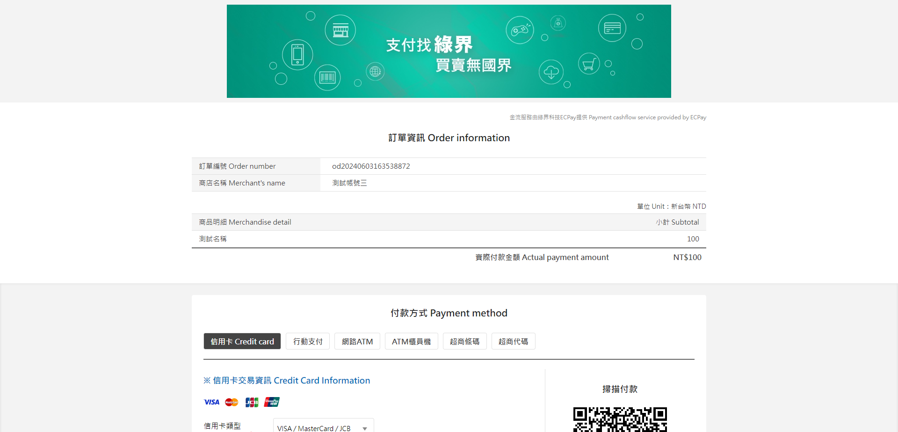
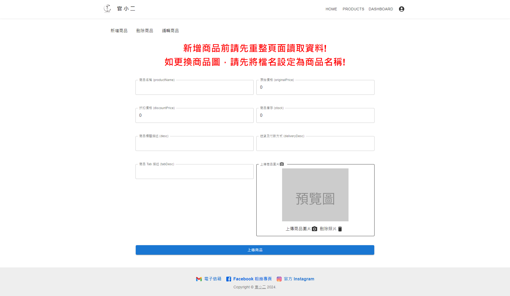
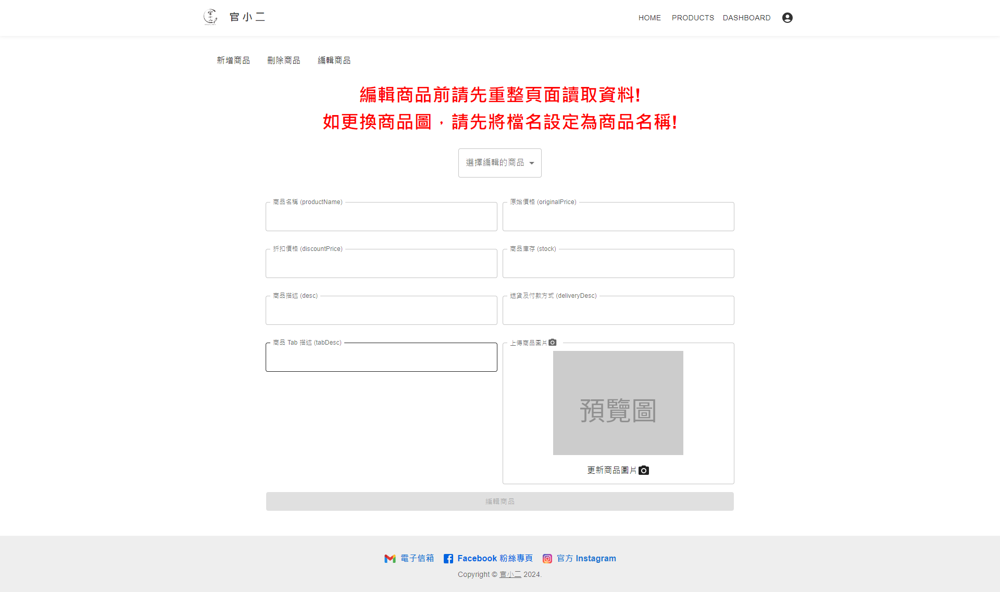
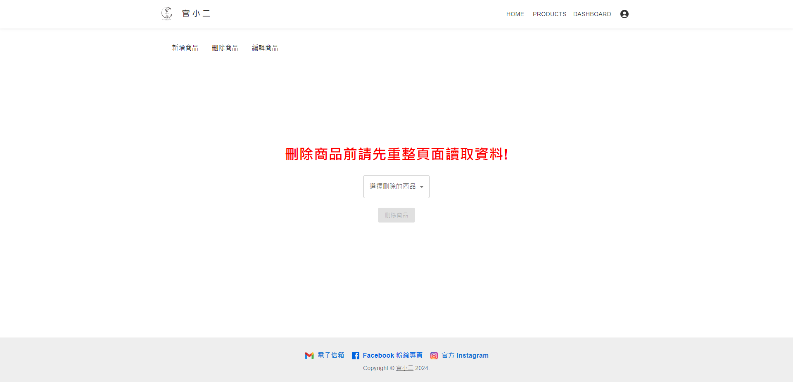
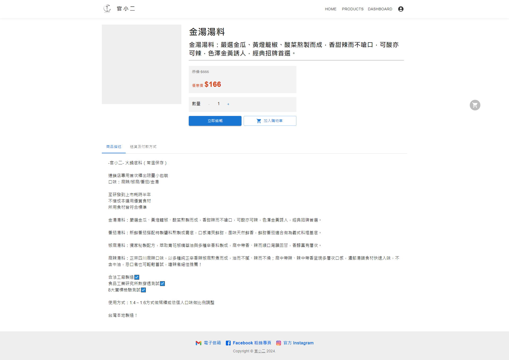

   
   <h2>guan-shopping eCommerce 食品電商網站</h2>

guan-shopping eCommerce 是一個基於 React.js + Material UI + Firebase 建構而成的電子商務網站，支援 RWD，畫面以 Material UI 元件為主，樣式採用 CSS-in-JS 撰寫，平台使用者主要可分為管理員 (admin)、會員 (member) 兩種身分，管理員可自由新增、編輯、刪除商品。

## 線上演示

- Demo：https://guan-shopping-web.web.app/
- 後端 API（綠界金流代理）：https://guan-shopping-backend.zeabur.app/

## 使用技術

### 基礎應用

- HTML
- CSS
- JavaScript (ES2015)

### 前端框架、套件

- React
- React Hooks
- React Router
- Redux toolkit
- Redux Saga
- React Hook Form
- Material UI
- yup validation
- axios

### Firebase 服務

- Authentication
- Cloud Firestore
- Cloud Storage
- Hosting

### 其他工具

- ESLint
- Prettier

### 專案功能

- 使用 Firebase Authentication 管理用戶
- 使用 Firebase Firestore 操作資料庫
- 使用 Firebase Storage 上傳圖片
- 使用 Google Cloud 儲存快取
- 使用 Redux toolkit 管理狀態
- 使用 React Hook Form 登入驗證
- 使用 yup 上架、編輯商品驗證
- 購物車 (CRUD)
- 商品管理 (CRUD)
- 骨架屏載入
- 發送密碼重製郵件
- 模擬綠界金流結帳

## 網站展示

- 首頁

- 商品列表

- 商品資訊

- 登入/註冊會員

- 購物車

- 綠界模擬結帳

- 後台 - 新增商品

- 後台 - 編輯商品

- 後台 - 刪除商品

- 骨架屏 - 商品列表

- 骨架屏 - 商品資訊

## 2026-04 安全與體驗重構

兩年後回頭檢視這個作品，針對當時為了 demo 便利而留下的安全漏洞與設計問題做了一次系統性重構。每項都附 commit 連結可追蹤。

### 1. 綠界金流 — 敏感邏輯回歸後端

**問題**：原本 `HashKey` / `HashIV` 寫死在前端 `Payment.jsx`，任何人透過 DevTools 就能偽造訂單金額；callback 也沒驗簽，`console.log` 就回 `OK`。

**改動**：

- HashKey 移到後端環境變數，前端只送金額給後端 `/api/payment/create` 簽章 ([e489d5b](../../commit/e489d5b))
- callback 用 `crypto.timingSafeEqual` 驗簽，不通過回 `0|CheckMacValue Invalid`
- `MerchantTradeNo` 改為每請求生成（原本是 module scope 常數，並發會撞號）
- `ecpayUrlEncode` 補齊 `~→%7e`、`'→%27` edge case（參考綠界官方 [ECPay API Skill](https://github.com/ECPay/ecpay-api-skill)）
- 修正 `ReturnURL` / `OrderResultURL` / `ClientBackURL` 三者混用錯誤

### 2. 登入狀態 — 從可偽造的 localStorage 改用 Firebase 訂閱

**問題**：原本 `App.js` 判斷登入靠 `localStorage.getItem("isMember") === "true"`，使用者在 DevTools 執行 `localStorage.setItem("isMember","true")` 就能繞過守門進入管理後台。

**改動** ([b97e284](../../commit/b97e284))：

- 訂閱 Firebase `onAuthStateChanged` 作為 Redux state 的單一真實來源
- 新增 `<RequireAuth>` route guard 包住 Dashboard 路由
- 移除 UserSaga 裡所有 `localStorage.setItem("user"/"isMember", ...)` 的 dead write
- Firebase SDK 自身用 IndexedDB 持久化 session，重整頁面會自動還原

### 3. 全域 LoadingMask — Redux counter 處理並發

**問題**：登入/結帳各自用 `useState` 管 loading，散亂且無法處理多個請求重疊的情況。

**改動** ([85cef6e](../../commit/85cef6e))：

- 新增 `uiSlice` 存 `loadingCount`，`showLoading` / `hideLoading` 分別 +1/-1
- `<LoadingMask>` 依 counter > 0 顯示 MUI Backdrop（80% 黑）
- Counter 模式安全處理並發請求（避免互相蓋掉 state）
- 接線到登入三條 Saga（email/Google/create）與結帳流程

### 4. 其他品質改善

- Header 英文 → 中文一致化（`HOME/PRODUCTS/DASHBOARD` → `首頁/商品/商品管理`）([2e6dc33](../../commit/2e6dc33))
- 全站路由改小寫 + kebab-case（`/Login` → `/login`，`/Dashboard/addProduct` → `/dashboard/add-product`）符合 REST / SEO 慣例 ([f25e3b3](../../commit/f25e3b3))
- 順便修正 Header nav 與 user menu 的路徑大小寫不一致導致 React Router v6 對不上 route 的 bug

### 架構判斷

刻意**不做完整 BFF**：Firestore 讀寫由前端直連配合 Security Rules 即可，只有真正含 secret 的邏輯（金流簽章）搬到後端。這反映「什麼該放後端 / 什麼前端直連」的取捨思路，而非為架構而架構。

### 已知但未處理的項目（trade-off 後刻意延後）

- TypeScript 導入（1-3 天工，優先修完安全問題）
- Redux-Saga 換 Zustand（Saga 對此規模過重，但遷移風險大）
- `UserSaga.js` 登入失敗自動註冊邏輯（危險但牽動既有使用者流程）
- 依賴版本升級（Dependabot 顯示 100+ 漏洞，多為 `react-scripts` 傳遞依賴）

## 圖片引用來源

- 官小二

## 聲明

- 本作品內圖片、內容等，純粹為個人練習前端使用，不做任何商業用途。